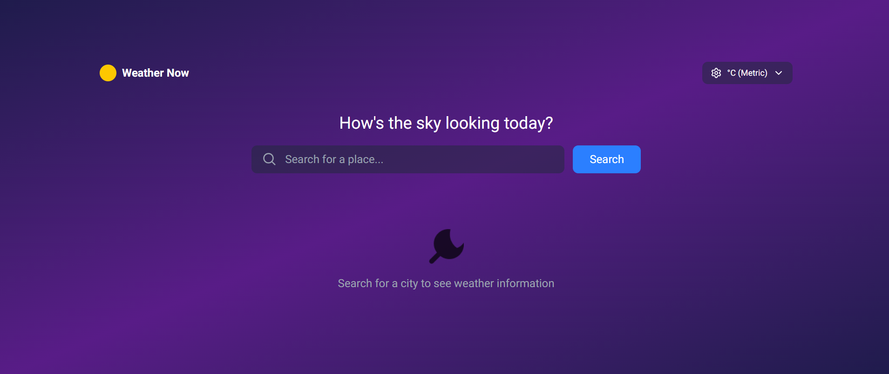

# 🌦️ Responsive Weather Application  

A responsive weather application built with **React.js** that fetches real-time weather data from the **OpenWeatherMap API**. The app follows the provided [Figma Design](https://www.figma.com/design/kYIFVoln5iuxQqWZQDoy6F/weather-app?node-id=156-791&t=XyZL0MQEa5GEexbQ-1) and includes **search, weather display, forecast, and error handling** features.  

---

## 🚀 Features  

### 🔍 Search Implementation  
- Search for any city using the search bar.  
- Display real-time weather data for the searched city.  
- Show error messages for invalid city names.  
- Clear input automatically after a successful search.  

### 🌡️ Weather Display  
- Current temperature (large display).  
- Weather condition with icon.  
- City name & country.  
- Current date.  

### 📊 Weather Statistics  
- Feels-like temperature.  
- Humidity percentage.  
- Wind speed.  
- Atmospheric pressure (or precipitation).  

### 📅 Forecast Display  
- **6-day forecast**:  
  - Day names  
  - High/Low temperatures  
  - Weather icons  
- **Hourly forecast (8 hours minimum)** for the selected day.  

### 🌀 UI States  
- **Loading state**: Shown during API calls.  
- **Error state**: For failed requests (invalid city, network issue).  
- **Empty state**: Before the first search.  

---

## ⚙️ Tech Stack  

- **Frontend:** React.js  
- **Styling:** Tailwind CSS (responsive mobile-first design)  
- **State Management:**  Redux  
- **Deployment:** Vercel  
- **API Provider:** [OpenWeatherMap](https://openweathermap.org/)  

---

## 🖥️ Installation & Setup  

1. **Clone the repository**  
```bash
git clone https://github.com/Disha-1751999/weather-app
cd weather-app
```

2. **Install dependencies**  
```bash
npm install
```

3. **Setup environment variables**  
```bash
NEXT_PUBLIC_API_KEY=9d729cfd40c256defac28e6a8266b774
NEXT_PUBLIC_BASE_URL=https://api.openweathermap.org
```

4. **Run the project**  
```bash
npm run dev
```

5. **Run the project**  
```bash
npm run build
```

6. **Run in production**  
```bash
npm start
```

## 📸 Screenshots

### Initial Screen 
  

### Loading Screen  
 

### Dashboard
 

### Error Screen  
 